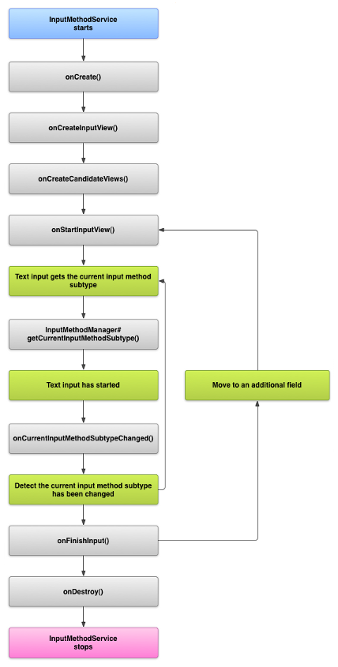

##输入法深入理解

###从实现一个android输入法的角度来分析android输入法。

扩展的输入法框架，允许应用为用户提供不同的输入法，比如触屏键盘甚至语音输入。只要安装，用户就可以从系统设置中选择自己喜欢使用的输入法，并且在整个系统环境中使用；在同一时刻，只有一种输入法可以使用。

创建输入法首先需要继承InputMethodService类，这个是输入法的Main class.
通常还要创建一个”settings”的activity，用来向IME服务传递参数选项。你也可以自定义设置界面，把它作为系统设置的一部分。

- 输入法的生命周期
- 在application manifest中声明IME组件
- 输入法 API
- 设计输入法的用户界面
- 从输入法向应用程序发送文本
- 创建不同类型的输入法

文档中可以找到所有输入类型的完整描述。使用正确的输入类型是很重要的，这样软键盘就可以为用户输入的文本使用最优的键盘布局。
inputType也是可以任意组合。
> Xml代码:
```xml
<EditText android:id="@+id/edtInput" android:layout_width="0dip"   
  android:layout_height="wrap_content"  
  android:layout_weight="1"  
 android:inputType="textShortMessage|textAutoCorrect|textCapSentences|textMultiLine"  
  android:imeOptions="actionSend|flagNoEnterAction"  
  android:maxLines="4"  
  android:maxLength="2000"  
  android:hint="@string/compose_hint"  
/> 
 ```


可以在AndroidManifest.xml指定当activity显示时是否自动显示IME
> Xml代码:
```xml
<activity name="EditContactActivity" android:windowSoftInputMode="stateVisible|adjustResize">  
...  
</activity> 
```

输入法的定制最终也是对action button的定义
例如：
>- 重载enter键
>- 全屏键

一个预定义的动作常量(actionGo、actionSearch、actionSend、actionNext、actionDone)。如果这些都没有指定，系统将根据是否有一个可聚焦的字段来推断下一步操作或操作;您可以显式地强制使用actionNone操作。
```xml
<EditText android:imeOptions="actionSend|flagNoEnterAction" />
 
```
> 大多数情况下输入法和应用程序之间的交互是通过android.view.inputmethod.InputConnection 这个类实现的。
这个类是一个应用的实现。一个IME调用来对应用程序执行适当的编辑操作。您通常不需要为此担心，因为TextView提供了它自己的实现


####- 输入法的生命周期


android输入法的生命周期


####- 在application manifest中声明IME组件

> 下面的代码声明了一个输入法的service.它请求了BIND_INPUT_METHOD 权限，来允许服务把IME和系统关联起来，创建一个intent filter来匹配android.view.InputMethod,并且定义了输入法的元数据。


```xml
<service android:name=".PinyinIME"
    android:label="@string/ime_name"
        android:permission="android.permission.BIND_INPUT_METHOD">
    <intent-filter>
        <action android:name="android.view.InputMethod" />
    </intent-filter>
    <meta-data android:name="android.view.im" android:resource="@xml/method" />
</service>
```

> 下一个代码片段声明了输入法的设置activity.它包含了一个ACTION_MAIN的intent filter，表示此activity作为整个输入法应用的入口。

```xml
<activity android:name=".SettingsActivity"
    android:label="@string/ime_settings_activity_name">
    <intent-filter>
        <action android:name="android.intent.action.MAIN"/>
    </intent-filter>
</activity>
```
####- 输入法的API
> 在android.inputmethodservice和android.view.inputmethod包中可以找到输入法相关的class。其中KeyEvent 是处理字符按键的重要类。

> 输入法的中心环节就是一个service组件，该组件扩展了InputMethodService。除了实现普通的service生命周期以外，该类需要给UI层提供回调函数，用来处理用户输入，并且把文本传递给输入焦点。InputMethodService类实现了大部分管理输入法状态、界面以及和当前输入框通信的逻辑。

以下class同样重要：

**BaseInputConnection**

定义了从输入法到接收输入的应用程序之间的通信通道。使用该类可以获取光标附近的文本，可以把字符串提交给文本框，还可以向应用程序发送原生的按键消息。应用程序应该扩展该类，而不要实现InputConnection。

**KeyboardView**

该类扩展了View使其能够展现出一个键盘并且相应用户的输入事件。可以通过一个XML文件来定义键盘布局。


####- 设计输入法的用户界面
> -输入法有两个主要的可见的界面元素：输入窗和候选窗。你只需要实现和输入法相关的界面元素即可。
Input view

输入窗是指用户通过按键或手写或手势直接产生的文本展示区域。当输入法首次展现时，系统调用onCreateInputView()回调函数。你需要在该方法中创建输入法界面布局，并将该布局返回给系统。下面的代码片段实现了onCreateInputView()方法：

```java
 @Override
    public View onCreateInputView() {
        MyKeyboardView inputView =
            (MyKeyboardView) getLayoutInflater().inflate( R.layout.input, null);

        inputView.setOnKeyboardActionListener(this);
inputView.setKeyboard(mLatinKeyboard);

        return mInputView;
    }

```
复制代码

在该实例中，MyKeyboardView实现了类[KeyboardView](https://developer.android.com/reference/android/inputmethodservice/KeyboardView.html)，用来自定义一个键盘。如果你使用传统的QWERTY键盘，请参见KeyboardView类。